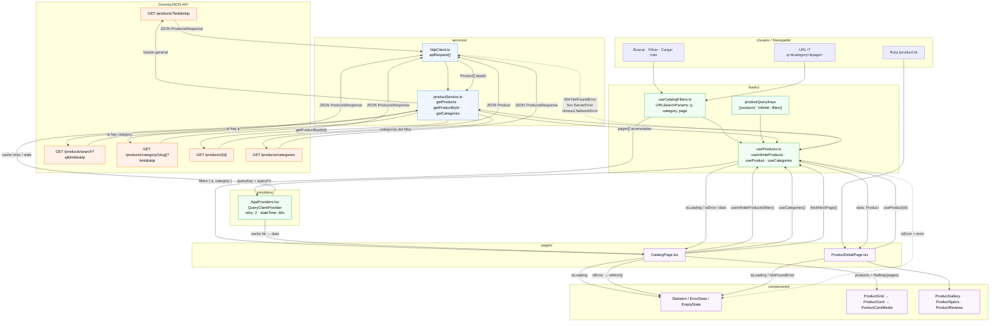

# Flujo de datos: DummyJSON → TanStack Query → UI

Diagrama basado en la estructura real de `src/` en InterCommerce.

## Lectura rápida del flujo

### Catálogo (`/`)

1. **URL / filtros** — `useCatalogFilters` lee y escribe `q`, `category` y `page` en la URL.
2. **Hook** — `CatalogPage` llama `useInfiniteProducts({ q, category })` y `useCategories()`.
3. **TanStack Query** — Resuelve por `productQueryKeys`; si no hay caché válida, ejecuta `queryFn`.
4. **Service** — `productService.getProducts()` elige endpoint según filtros y delega en `apiRequest`.
5. **HTTP** — `httpClient` hace `fetch` a DummyJSON, parsea JSON y tipa la respuesta.
6. **UI** — Query devuelve `data.pages`; la página aplana a `products[]` y renderiza `ProductGrid` / `ProductCard`. Estados: skeleton, error o vacío.

### Detalle (`/product/:id`)

1. **Ruta** — `ProductDetailPage` obtiene `id` de la URL.
2. **Hook** — `useProduct(id)` con `staleTime` 300 s y sin reintentos en 404.
3. **Service** — `getProductById` → `GET /products/{id}`.
4. **UI** — `ProductGallery`, specs y reseñas; `ErrorState` o 404 si falla.

### Nota: carrito (client state)

El carrito **no pasa por TanStack Query**. Tras agregar desde catálogo/detalle, los datos del producto ya están en memoria y `useCart` + `cartBusiness` manejan el estado local (LocalStorage).
